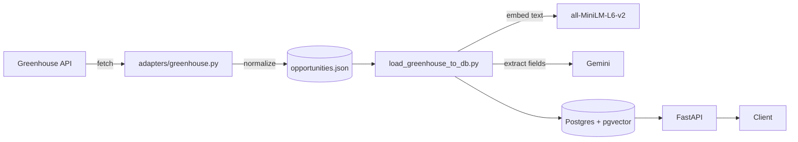

# CareerOpportunityEngine


FastAPI + Postgres/pgvector service that ingests job postings, normalizes
them into one schema, indexes them for semantic search, and uses an LLM to
pull structured eligibility info (visa sponsorship, language requirements,
seniority, remote policy) out of the raw posting text.

## Architecture



| Folder | Role |
| --- | --- |
| `app/adapters/` | Fetches raw data from one external source, no business logic |
| `app/schemas/` | Pydantic shapes, source-independent |
| `app/models/` | SQLAlchemy tables |
| `app/db/` | Engine/session, Alembic migrations |
| `app/services/` | Querying, embeddings, eligibility extraction |
| `app/api/` | Thin FastAPI routers |
| `scripts/` | One-off scripts, not part of the running app |

Reasoning behind specific decisions (adapter pattern, pgvector over a
dedicated vector store, etc.) is in [`docs/adr/`](docs/adr/).

## Running it

**Docker:**

```bash
cp .env.example .env   # Postgres credentials + GEMINI_API_KEY
docker compose up --build
```

Brings up Postgres and the API, applies migrations automatically. Docs at
`http://localhost:8000/docs`.

**Local dev:**

```bash
uv sync
docker compose up -d postgres
uv run alembic upgrade head
uv run uvicorn app.main:app --reload
```

## Loading data

```bash
uv run python -m scripts.fetch_greenhouse
uv run python -m scripts.load_greenhouse_to_db
```

Pulls N26's public Greenhouse postings, embeds and eligibility-extracts each
one, writes to Postgres. Both are idempotent - reruns update existing rows
instead of duplicating them, and eligibility (a paid API call) is only
extracted once per posting.

## API

- `GET /opportunities` - paginated list (`limit`, `offset`)
- `GET /opportunities/search` - semantic search (`q`, `limit`)

Search ranks by meaning, not keyword overlap. Querying
`money laundering compliance detective work` - zero words shared with any
posting - still surfaces the right result:

```json
[
  { "title": "AFC Analyst – Italian market", "score": 0.512 },
  { "title": "AFC Operations Team Lead Italy (Fixed-Term Contract)", "score": 0.406 },
  { "title": "Fraud Analyst – Operations", "score": 0.358 }
]
```

(AFC = Anti-Financial Crime. An unrelated query like "baking bread and
pastries" scores everything below 0.07.)

## Testing

```bash
uv run pytest                 # unit tests: mocked externals, SQLite instead of Postgres
uv run pytest -m integration  # hits real Greenhouse, Gemini, and the embedding model
uv run ruff check .
uv run mypy app scripts alembic
```

## License

[MIT](LICENSE)
