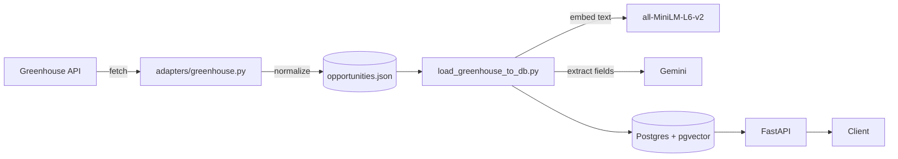

# CareerOpportunityEngine


A backend that pulls job postings from external sources, normalizes them into
one internal model, and serves them through a REST API with semantic search
and LLM-based eligibility extraction (visa sponsorship, language
requirements, seniority, remote policy).

**In one line:** FastAPI + Postgres/pgvector backend that ingests job
postings, embeds and semantically searches them, and extracts structured
eligibility data with an LLM - built incrementally with tests, CI, and typed
Python throughout.

## Architecture



Each folder under `app/` answers one question:

| Folder | Question it answers |
| --- | --- |
| `app/adapters/` | Where does raw data come from? (one file per source, no business logic) |
| `app/schemas/` | What shape is the data? (Pydantic, source-independent) |
| `app/models/` | How is it stored? (SQLAlchemy) |
| `app/db/` | Where and how is it persisted? (engine/session, Alembic) |
| `app/services/` | What logic runs on it? (querying, embeddings, eligibility) |
| `app/api/` | How does the outside world reach it? (thin routers) |
| `app/core/` | Shared config, logging |
| `scripts/` | One-off scripts, not part of the running app |

Architecture decisions with their reasoning are in [`docs/adr/`](docs/adr/).

## Data flow example

Raw Greenhouse response:

```json
{"id": 8556658002, "title": "AI Engineer", "content": "&lt;p&gt;5+ years...&lt;/p&gt;"}
```

After the adapter normalizes it (`OpportunityIngest`):

```json
{"title": "AI Engineer", "description": "&lt;p&gt;5+ years...&lt;/p&gt;", "external_id": "8556658002", "source": "greenhouse"}
```

### Semantic search in practice

The query below shares **zero words** with the phrase "Anti-Financial Crime"
used in the actual postings, yet still ranks them first:

```bash
curl "http://127.0.0.1:8000/opportunities/search?q=money+laundering+compliance+detective+work&limit=3"
```

```json
[
  { "title": "AFC Analyst – Italian market", "score": 0.512, "organization_name": "N26", "...": "..." },
  { "title": "AFC Operations Team Lead Italy (Fixed-Term Contract)", "score": 0.406, "...": "..." },
  { "title": "Fraud Analyst – Operations", "score": 0.358, "...": "..." }
]
```

A genuinely unrelated query (`baking bread and pastries`) scores every
posting below 0.07 - the ranking reflects meaning, not coincidence.

## Running with Docker

```bash
cp .env.example .env   # fill in Postgres credentials and GEMINI_API_KEY
docker compose up --build
```

Starts Postgres and the API together; migrations run automatically on
container start. API docs at `http://localhost:8000/docs`.

## Running locally (without Docker for the app)

```bash
uv sync
cp .env.example .env
docker compose up -d postgres
uv run alembic upgrade head
uv run uvicorn app.main:app --reload
```

## Loading real data

```bash
uv run python -m scripts.fetch_greenhouse        # fetch + normalize -> data/*.json
uv run python -m scripts.load_greenhouse_to_db   # embed, extract eligibility, persist
```

Both are idempotent: reruns update existing rows instead of duplicating them,
and eligibility (a paid API call) is only extracted once per posting.

## API

Interactive docs (Swagger UI) at `/docs` once the server is running.

### `GET /opportunities?limit=&offset=` - paginated list

```bash
curl "http://127.0.0.1:8000/opportunities?limit=1"
```

```json
{
  "items": [
    {
      "title": "Vendor Management Internship",
      "description": "About the opportunity... (raw HTML from the source)",
      "type": "job",
      "url": "https://n26.com/en-eu/careers/positions/8015153",
      "organization_name": "N26",
      "source": "greenhouse",
      "created_at": "2026-09-20T19:25:47.621006"
    }
  ],
  "total": 78,
  "limit": 1,
  "offset": 0
}
```

### `GET /opportunities/search?q=&limit=` - semantic search

See the [example above](#semantic-search-in-practice) - ranked by pgvector
cosine similarity, not keyword matching.

## Testing

```bash
uv run pytest                 # fast unit tests, no network/DB required
uv run pytest -m integration  # also hits Greenhouse, Gemini, and the embedding model
uv run ruff check .
uv run mypy app scripts alembic
```

Unit tests mock external calls and use SQLite in place of Postgres;
integration tests are excluded from CI since they depend on live services.

## License

[MIT](LICENSE)
